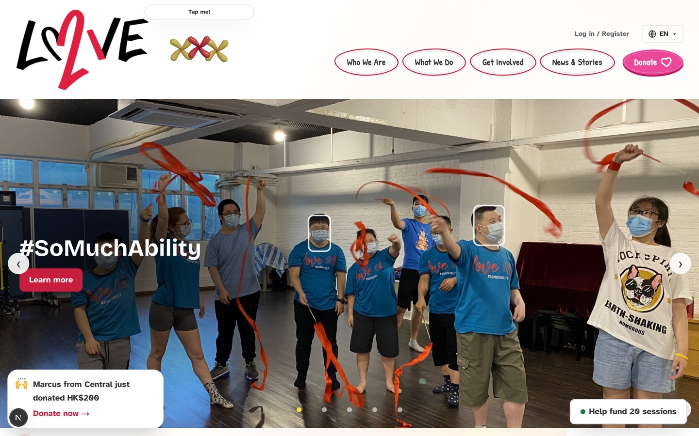
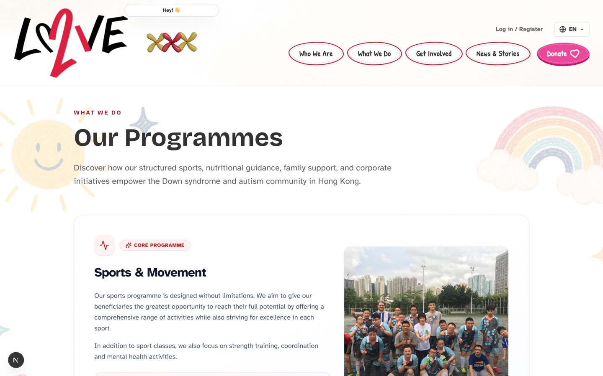
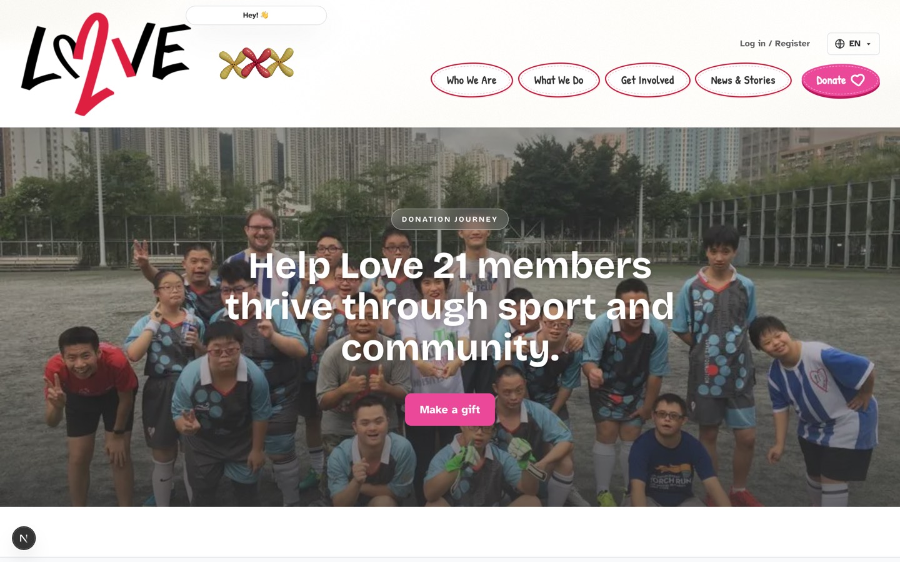
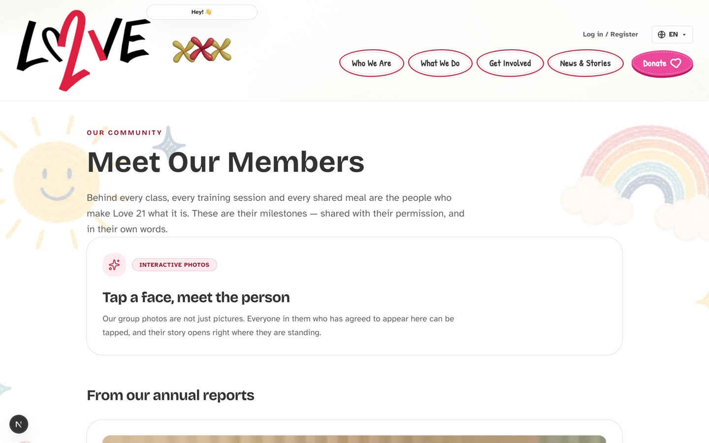
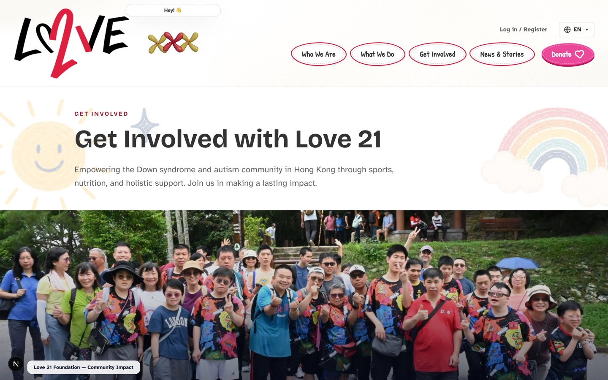

# Love 21 Foundation — Code to Give 2026

A website for [Love 21 Foundation](https://www.love21foundation.com/), a Hong
Kong charity providing sport, nutrition and family support to people with Down
syndrome and other neurodiverse conditions.

Next.js 16 frontend, FastAPI backend, Supabase/Postgres. Everything below runs
locally with no paid services: face recognition runs on your own machine, and so
does the chatbot.



---

## Quick start

Both halves must be running. Two terminals:

```bash
# Terminal 1 — backend, http://127.0.0.1:8000
cd backend
uv sync
uv run uvicorn app.main:app --reload --port 8000
```

```bash
# Terminal 2 — frontend, http://localhost:3000
cd frontend
npm install
npm run dev
```

Then open **<http://localhost:3000>**.

> Browse at `localhost:3000`, **not** `127.0.0.1:3000`. Next 16 treats them as
> different origins and silently blocks `/_next/*`, so the page renders but no
> JavaScript ever hydrates — nothing is interactive and there is no console error
> explaining why.

### Environment

Both env files are gitignored. Copy the examples:

```bash
cp backend/.env.example backend/.env
cp frontend/.env.local.example frontend/.env.local
```

The defaults work as-is. **Leave the Supabase keys blank and the app still
runs** — database-backed routes return 503 and nothing else changes, so a fresh
clone is never broken by a missing key. Fill them in from the Supabase dashboard
(Project Settings → API keys) when you want stories, admin, or analytics.

| Variable | Where | Purpose |
|---|---|---|
| `CORS_ORIGINS` | `backend/.env` | Origins allowed to call the API from a browser. |
| `SUPABASE_URL` | `backend/.env` | Project URL. |
| `SUPABASE_PUBLISHABLE_KEY` | `backend/.env` | RLS-enforced access. |
| `SUPABASE_SECRET_KEY` | `backend/.env` | Service role. Bypasses RLS. Server-side only. |
| `CHATBOT_ENABLED` | `backend/.env` | `false` drops the assistant so a teammate without Ollama still gets a working site. |
| `INSTAGRAM_ACCESS_TOKEN` | `backend/.env` | Optional. Without it the gallery serves fixtures. |
| `NEXT_PUBLIC_API_URL` | `frontend/.env.local` | Where the frontend looks for the backend. |
| `NEXT_PUBLIC_SUPABASE_*` | `frontend/.env.local` | Browser-side auth. |

Anything prefixed `NEXT_PUBLIC_` is inlined into the browser bundle. **Never put
a secret behind one.**

---

## What's in it

| | |
|---|---|
| **Public site** | Landing page, programmes, team, member stories, events, donation journey, a volunteer-matching quiz |
| **44 languages** | Google Translate integration with a searchable picker; native names and flags, RTL handled |
| **Assistant** | A retrieval-backed chatbot living inside the mascot, running on a local Ollama — nothing leaves the machine |
| **Face tagging** | On-premise recognition suggests who is in a group photo; a human confirms every tag |
| **Volunteer portal** | Public application intake, then a staff workflow through vetting, trial and approval |
| **Analytics** | Anonymous page/interaction counting with a staff dashboard |
| **Staff tool** | `/admin` — members, photos, volunteers, analytics — behind Supabase auth and Postgres-side roles |

### Screenshots

| | |
|---|---|
|  |  |
| **Programmes** | **Donation journey** |
|  |  |
| **Member stories — tap a face** | **Get involved** |

---

## Layout

```
backend/                     FastAPI
  app/main.py                CORS, /health, router registration
  app/config.py              settings from the environment
  app/db.py                  the only place a Supabase client is built
  app/auth.py                JWT verification + the staff-role gate
  app/faces.py               the only module importing cv2
  app/routers/               one module per resource
  app/features/<name>/       self-contained: analytics, chatbot, instagram
  tests/                     pytest, offline — FakeDb stands in for PostgREST
supabase/migrations/         schema history, one .sql per applied migration
content/impact-stats.yaml    every number on the site, with a source
frontend/                    Next.js 16 App Router, React 19, Tailwind v4
  app/                       routes only — a page composes, it does not define
  components/ui/             the design system
  components/layout/         PageShell, header, footer, navigation
  features/<name>/           one folder per feature
  lib/                       api.ts, admin.ts, supabase/, roles.ts
docs/superpowers/specs/      dated design docs
```

Three frontend rules the codebase has already paid for breaking:

1. **Colour comes from `app/globals.css`, never a Tailwind palette.** A literal
   `text-zinc-950` in a diff is a bug — it is how the site once ended up with
   five palettes, one per contributor.
2. **Reach for `components/ui` before writing markup.** If you are typing
   `rounded-2xl border bg-white p-6`, you want `<Card>`.
3. **Never restate focus styles.** `globals.css` declares one 3px ring for every
   interactive element.

---

## API

Interactive docs, generated from the route signatures:
**<http://127.0.0.1:8000/docs>**

### Public

| Route | Returns |
|---|---|
| `GET /health` | `{"status": "ok", "database": true}` — reports configuration, not reachability |
| `GET /api/participants` | Published participants, in display order |
| `GET /api/participants/{slug}` | One participant; 404 if unknown *or* unpublished |
| `GET /api/photos` | Published photos with signed URLs and confirmed face tags |
| `GET /api/instagram/posts` | Recent posts, cached; fixtures when no token is set |
| `POST /api/chat` | `answer`, `route`, `sources`, `action`, `followups`, `locale` |
| `POST /api/analytics/events` | Anonymous page/interaction events |
| `POST /api/volunteers/applications` | Submit a volunteer application |

### Authenticated

| Route | Returns |
|---|---|
| `GET /api/me` | The signed-in user, their roles, and whether they are staff |
| `GET /api/volunteers/me/applications` | Your own applications and their status |

### Staff only

Every `/api/admin/*` route needs `Authorization: Bearer <supabase access token>`
from an account holding a staff role.

| Route | Does |
|---|---|
| `GET /api/admin/participants` | List with consent bookkeeping |
| `POST /api/admin/participants` | Create; portrait is enrolled in the same insert |
| `POST /api/admin/participants/{id}/enroll` | Register a face so the matcher recognises them |
| `POST /api/admin/photos` | Upload a group photo; returns detected faces with suggested names |
| `PATCH /api/admin/faces/{id}` | Confirm, correct, or reject a tag |
| `GET /api/admin/volunteers/applications` | The volunteer pipeline |
| `PATCH /api/admin/volunteers/applications/{id}` | Advance status, record vetting |
| `GET /api/admin/analytics/summary?days=` | Everything the dashboard draws |

---

## Admin access

Staff sign in with **a password or a magic link** at
<http://localhost:3000/admin/login> — both land on the same authorization check.
There is no shared token: the previous `ADMIN_TOKEN` granted service-role access
to anyone who learned it, could not be revoked for one person, and left no record
of who had used it.

**Identity and permission are separate, on purpose.** The JWT proves *who* you
are; `public.user_roles` decides *what you may do*. A role claim inside a token
grants nothing, because a caller can put anything in a token they mint.

| Role | Can |
|---|---|
| `admin` | Everything, including granting roles |
| `editor` | The staff tool: participants, photos, face tags, volunteers, analytics |
| `supporter` | Their own profile. The default for any new sign-up. |

`public.role_allowlist` maps an email to the role it should receive, and
inserting a row is the whole of "create a staff member": one trigger provisions
the `auth.users` row, another grants the listed role. Someone who signs up
unlisted becomes a `supporter` — the default has to be the harmless one.

```sql
insert into public.role_allowlist (email, role, note)
values ('someone@love21foundation.com', 'editor', 'Programme staff');
```

If they already have an account, grant it now too:

```sql
insert into public.user_roles (user_id, role)
select u.id, a.role from auth.users u
join public.role_allowlist a on a.email = lower(u.email)
on conflict do nothing;
```

Revoke by deleting **both** the `user_roles` row and the `role_allowlist` entry
— removing only the allowlist leaves the existing grant in place.

### ⚠️ The default password

Every staff account starts with the password **`changeme`**. That is one shared,
published default: anyone who knows a staff address and has read this repository
can sign in as them. Fine for a demo, not for a site holding anything private.
Before that point, give each account its own:

```bash
cd backend && uv run python scripts/set_staff_password.py someone@love21foundation.com
```

It prompts for the password rather than taking it as an argument — an argument
would sit in your shell history and in `ps`. A password grants nothing on its
own; `user_roles` still decides whether that session may open the staff tool.

> Also raise the floor in the dashboard: Supabase's default minimum is 6
> characters and leaked-password checking is off. Auth → Providers → Email → set
> a minimum of 12 and enable "Prevent use of leaked passwords".

### One-time Supabase setup

Two things that cannot be scripted:

1. **Auth → URL Configuration** — Site URL `http://localhost:3000`; add
   `http://localhost:3000/auth/callback` to Redirect URLs.
2. **Auth → Providers → Email** — enabled. For the demo, turn **Confirm email
   off** so a volunteer application can create an account without the built-in
   sender. In production, configure custom SMTP and turn it back on.

### Email gotchas

- **The built-in sender is rate-limited** to roughly two messages an hour, and
  the cap cannot be raised. A refused send still consumes an attempt. This is why
  passwords are the default path.
- **Sign in before a demo.** Sessions persist through the refresh token.
- **A magic link must be opened in the browser that requested it.** PKCE stores a
  verifier on the requesting device.
- **Links are single-use and short-lived.** A mail client that pre-fetches URLs
  can consume one before you click it.

---

## Database

Supabase project `fastapi-supabase-template`. Migrations are applied through the
Supabase MCP tools; every applied migration is saved into `supabase/migrations/`
so the schema has a history in git.

**Authorization lives in Postgres, not in Python.** Routers query through
`get_db`, which carries the publishable key, and RLS decides what comes back —
so `list_participants` has no visibility filter in it. Duplicating a policy in
Python is how the two silently drift apart.

Two rules are constraints rather than conventions: consent cannot be recorded
without a timestamp, and a row cannot be published without consent. Unpublishing
someone is one boolean, and a story cannot go live by accident.

> Adding a table? Read `.claude/skills/adding-an-rls-table` first. **A table
> without RLS is readable by anyone with the publishable key, which ships in the
> browser bundle.**

---

## Face recognition

Detection and matching run **entirely on your own server**. OpenCV YuNet finds
faces, SFace turns each into a 128-number signature, and pgvector matches it
against enrolled members inside Postgres. No image, face, or signature is sent to
any third party, and there is no per-call cost.

```bash
cd backend && uv run python scripts/fetch_models.py   # ~39MB, gitignored
```

When the models are absent, detection returns nothing and the admin tool falls
back to manual tagging rather than failing.

**The model proposes; a person decides.** An upload creates only *suggested*
tags, and RLS never shows those publicly. A staff member confirms each one, with
the match score displayed so they know when to distrust it.

Face signatures are biometric data and are treated as such: their own consent
flag, a trigger that refuses to store them without it, another that **deletes
them outright** when consent is withdrawn, and a table with RLS enabled and no
policies at all.

> Do not swap in InsightFace. Its code is MIT but its pretrained models are
> licensed for non-commercial research only.

---

## Assistant

```bash
ollama pull bge-m3 && ollama pull qwen3:1.7b
cd backend && uv run python -m app.features.chatbot.build_index
```

Everything runs against a local Ollama; nothing leaves the machine. A question is
embedded and ranked against a curated corpus. If the **top** match is a refusal
entry (medical, self-harm) at or above the confidence floor, that staff-written
answer is served verbatim and the model is never called. Otherwise the model
answers with the corpus as context, falling back to the nearest curated entry if
Ollama is unreachable.

**Rebuild the index after editing any `knowledge/*.yaml`** — a test fails if you
forget. Numbers are never typed into the corpus: write `{{ hkd_per_class }}` and
the value comes from `content/impact-stats.yaml`, so an unknown token stops the
app booting.

> The model writes text visitors read, so it can state things the corpus does not
> contain. Every fabrication observed so far has been on a topic with no entry
> behind it, so **coverage is the mitigation** — a stricter prompt was tried and
> made it worse. This is a deliberate trade, not an oversight.

---

## Analytics

`/admin/analytics` reports visits, page views, time on page, most-read pages and
tracked interactions.

**Nothing identifies a visitor.** No IP address, no user id, no cookie. A session
id is a random uuid in `sessionStorage` and dies with the tab — which is why the
dashboard says *visits* rather than "unique visitors". Time is counted only while
the tab is visible, so a tab left open overnight contributes the two minutes
someone actually read.

The tracker is mounted in `PageShell`, which is the whole staff-traffic
exclusion: `/admin/*` never uses the shell. Full design in
`docs/superpowers/specs/2026-08-02-analytics-design.md`.

---

## Tests

```bash
cd backend && uv run pytest
cd backend && uv run ruff check . && uv run ruff format .
cd frontend && npx tsc --noEmit      # typecheck, faster than a full build
cd frontend && npm run lint
```

Backend tests run offline: `FakeDb` in `tests/conftest.py` imitates the PostgREST
query builder and `get_db` is replaced through `dependency_overrides`.

> **`test_chatbot_index` failing?** The corpus was edited without rebuilding the
> index. That is the test doing its job — rebuild it (see [Assistant](#assistant)
> above), which needs Ollama running.

They cover routing, wiring and serialization. **They do not exercise RLS** —
`FakeDb` has no policy engine. Verify policies against a real project.

The frontend has no test runner; it is covered by typecheck and lint only.

---

## Known noise

- **Node 20.13.1** is below the 20.19+ `eslint-visitor-keys` asks for. Everything
  works; npm warns on install. Node 22 silences it.
- **`npm audit` reports high-severity findings** inside Next 16's own dependency
  tree. The only fix npm offers downgrades Next several major versions.
- **Dev analytics counts are inflated.** React StrictMode double-invokes the
  tracker and Fast Refresh remounts it on every save, so editing the site
  generates page views. Production mounts once.
